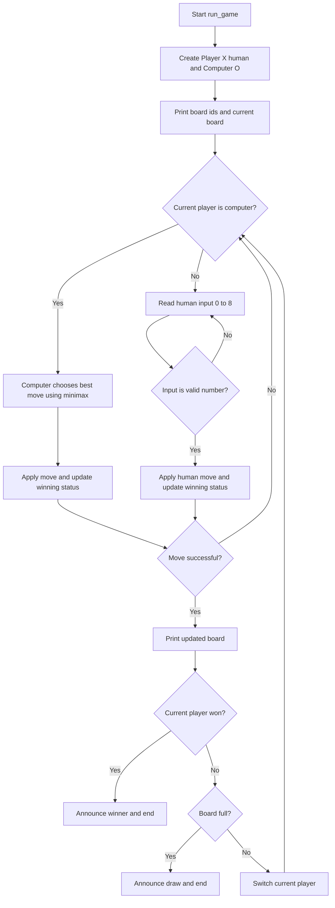

# Tic Tac Toe Script Flow

This document describes the execution flow of `board.py`.

## 1. Board Initialization

At startup, the script creates a global 3x3 board structure.
Each cell is a dictionary with:
- `id`: numeric cell id from 0 to 8
- `status`: current value (`" "`, `"X"`, or `"O"`)

## 2. Display Functions

### `print_ids()`
Prints the board with cell ids (0-8) so the player knows what command to enter.

### `print_board()`
Prints the current board state using each cell `status`.

## 3. Move Handling

### `set_move(cell_id, player)`
Responsible for placing a move on the board.

Flow:
1. Search all cells for matching `cell_id`
2. If found and empty, write player symbol and return `True`
3. If found but occupied, print error and return `False`
4. If id does not exist, print error and return `False`

## 4. Winner Check (Board-Based)

### `check_winner(player)`
Builds all possible winning lines for a player:
- 3 rows
- 3 columns
- 2 diagonals

Returns `True` if any line is `[player, player, player]`, otherwise `False`.

## 5. Minimax Support Functions

These helpers are used by the computer player.

### `get_board_state()`
Converts the 3x3 board into a flat list of 9 values so minimax can evaluate moves easily.

### `check_winner_in_state(state, player)`
Checks a winner directly on the flattened state using predefined winning index triples.

### `is_state_full(state)`
Returns `True` when no empty cells remain in the flattened state.

### `minimax(state, is_maximizing, ai_symbol, human_symbol)`
Recursive game-tree search that scores possible outcomes:
- `1` for AI win
- `-1` for human win
- `0` for draw

It explores all legal moves and returns the best score for the current side.

## 6. Player Classes

### `class Player`
Represents each player and encapsulates command behavior.

Properties:
- `name`
- `symbol`
- `winning_status`

Methods:
- `update_winning_status()`:
  Calls `check_winner(self.symbol)` and stores result in `winning_status`.
- `command(cell_id)`:
  Calls `set_move(cell_id, self.symbol)`.
  If move succeeds, updates `winning_status`.
  Returns `True`/`False` based on move result.

### `class ComputerPlayer(Player)`
Represents the AI player.

Extra property:
- `human_symbol`

Methods:
- `choose_best_move()`:
  Simulates each legal move and chooses the one with the highest minimax score.
- `command()`:
  Picks best move, prints selected cell, places move, and updates winning status.

## 7. Draw Check

### `is_board_full()`
Scans the board and returns:
- `False` if any empty cell exists
- `True` if all cells are occupied

## 8. Main Game Loop

### `run_game()`
Main controller of the game.

Flow:
1. Create two `Player` objects:
  - Human: `Player X`
  - Computer: `Computer` with symbol `O`
2. Set `current_player = player_x`
3. Print game start, board ids, and current board
4. Enter `while True` loop
5. If current player is computer:
  - Run `current_player.command()` (AI picks move using minimax)
6. If current player is human:
  - Read user command input
  - Validate numeric input
  - Execute `current_player.command(cell_id)`
7. If move is invalid, continue loop (same player retries)
8. Print updated board
9. Check win:
    - If `current_player.winning_status` is `True`, announce winner and break
10. Check draw:
    - If board is full, announce draw and break
11. Switch player:
    - `player_x -> player_o`
    - `player_o -> player_x`
12. Repeat until win or draw

## 9. Flowchart (Mermaid)



## 10. Entry Point

The script starts the game only when run directly:

```python
if __name__ == "__main__":
    run_game()
```

So importing `board.py` from another script will not automatically start the loop.
